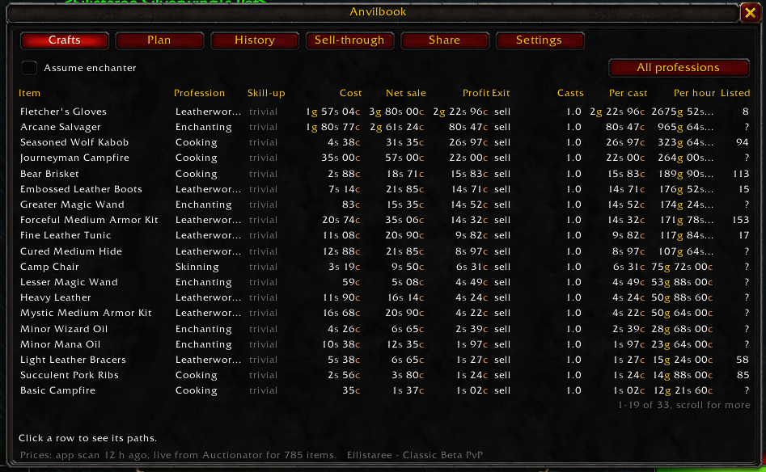
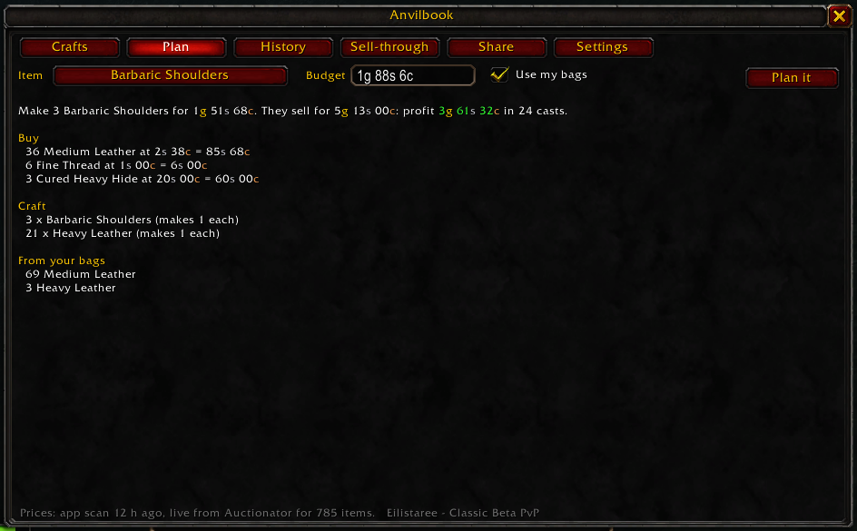
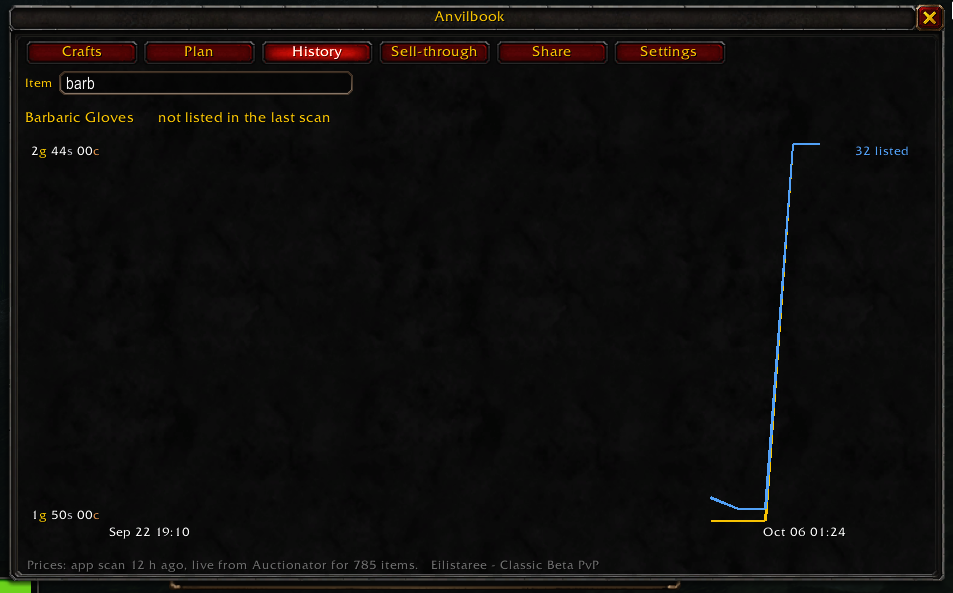
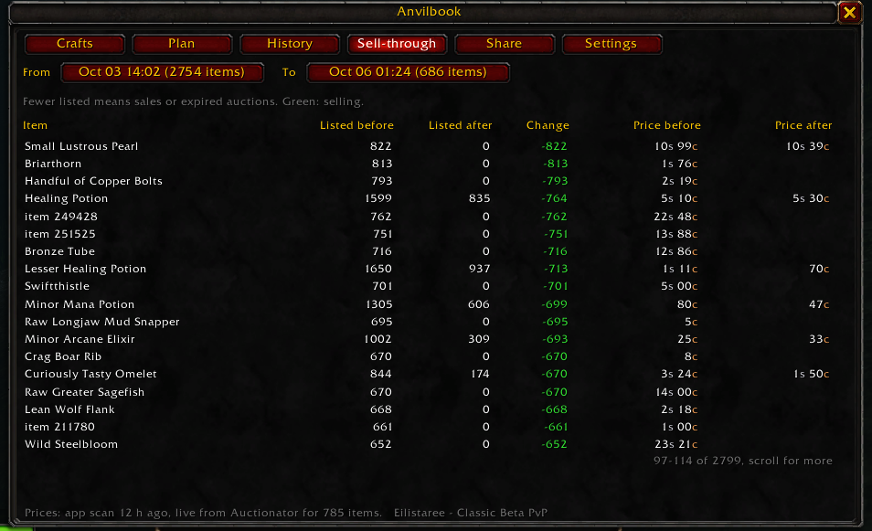
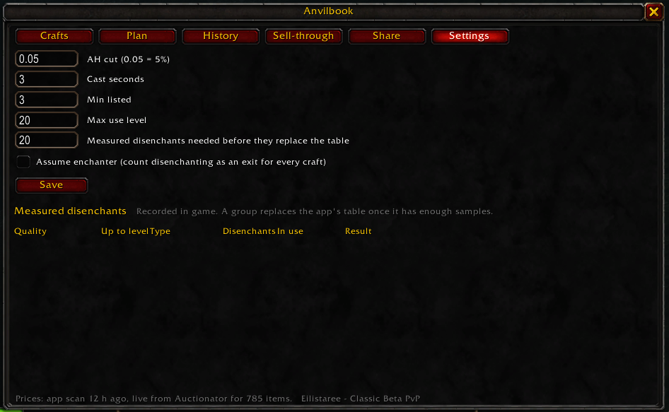

[](https://github.com/traagel/anvilbook/actions/workflows/test.yml)
[](https://pypi.org/project/anvilbook/)
[](https://github.com/traagel/anvilbook/releases)
[](https://github.com/traagel/anvilbook/releases)
[](https://www.curseforge.com/wow/addons/anvilbook-export)
[](LICENSE)


A local auction house and crafting ledger for **WoW Forever (Classic beta)**.

It reads the prices that the [Auctionator](https://www.curseforge.com/wow/addons/auctionator)
addon saves, keeps every scan as history, and tells you what is worth crafting with the
recipes your characters actually know.

Everything runs on your own computer. Nothing is uploaded unless you turn on sharing.



## What it does

- **Crafts**: for each recipe, the cheapest way to get every reagent (buy it, or craft it
  from its own reagents), the profit, and the profit for each cast. Skill-up colors come
  from the game.
- **Plan**: "I have 3g 43s, what do I buy?" It answers with a batch size, a shopping list
  with quantities, the crafting steps, what comes from your bags, and the leftovers.
- **History**: the lowest price and the listed count of any item over all your scans.
- **Sell-through**: what sold between 2 scans, which shows real demand.
- **Disenchanting**: values a crafted item by its disenchant materials as well as its sale
  price, and learns the real yields from the disenchants you do.
- **In game**: the same views in a game window, a shopping list beside the auction house, and
  lines on item tooltips. See [In game](#in-game).

## Install

You need [Auctionator](https://www.curseforge.com/wow/addons/auctionator) in game. anvilbook's own
addon, `AnvilbookExport`, ships inside the app, which installs it for you at first run. It is
also on CurseForge as [Anvilbook Export](https://www.curseforge.com/wow/addons/anvilbook-export).

**Windows:** download `anvilbook.exe` from the
[releases page](https://github.com/traagel/anvilbook/releases) and run it. Your browser
opens on the app.

**Anything else, with [uv](https://docs.astral.sh/uv/):**

```bash
uvx anvilbook
```

**From source:**

```bash
git clone https://github.com/traagel/anvilbook
cd anvilbook
uv run anvilbook
```

## First run

1. Point anvilbook at your game. Paste the path to `Auctionator.lua`, or press **Look for my game
   folder** and pick one of the results. It only searches your disk when you press that button,
   and it never sends anything anywhere.

   The file you want is the **saved data**, here:

   ```
   World of Warcraft\_classic_beta_\WTF\Account\<your id>\SavedVariables\Auctionator.lua
   ```

   Not the one inside `Interface\AddOns\Auctionator\`, which is Auctionator's own code. If the
   file is missing, Auctionator has not saved yet: log in, type `/reload`, and it appears. You can
   also point anvilbook at the `SavedVariables` folder itself.
2. Press **Install addon**. That copies the small `AnvilbookExport` addon into the game, so you
   do not have to download or move anything. See below if you would rather install it yourself.
3. Start WoW, or log out to the character screen if it was already running, so the game picks up
   the new addon. Open each profession window for a few seconds, then type `/reload`.
4. Scan the auction house with Auctionator, then type `/reload` again.

Step 3 gives anvilbook your recipes and skill levels. Step 4 gives it prices. Repeat step 4
whenever you want fresh prices; the app imports the file within 5 seconds of each `/reload`.

### Installing the addon by hand

The **Install addon** button does this for you. Do it yourself only if you prefer to:

1. Download `AnvilbookExport.zip` from the
   [releases page](https://github.com/traagel/anvilbook/releases).
2. Unzip it into the game's `Interface/AddOns` folder, next to your other addons. You should end
   up with `…/Interface/AddOns/AnvilbookExport/AnvilbookExport.toc`.
3. Log out to the character screen, and make sure **Anvilbook Export** is ticked in the AddOns
   list.

## Why `/reload`

WoW writes addon data to disk only when you log out, disconnect, or type `/reload`. No addon
can write files at another time, so `/reload` is how the data reaches anvilbook.

## In game

The `AnvilbookExport` addon also shows anvilbook in the game. Type `/anvilbook`, or click the
minimap button.

- The window has the web page's tabs: Crafts, Plan, History, Sell-through, Share and Settings.
  Right-click a craft to plan it.
- When you open the auction house, the plan's shopping list docks beside it. A row gets a tick
  when you have bought it, and one button searches for the whole list in Auctionator.
- Item tooltips show the listed count, the price change since the scan before, the craft profit,
  and the disenchant value.
- Esc > Options > AddOns > Anvilbook turns each part on or off. `/anvilbook options` opens it.

| | |
|---|---|
|  |  |
| Plan: what to buy and craft for a budget | History: price and listed count over the scans |
|  |  |
| Sell-through: what sold between 2 scans | Settings, which reach the app at the next `/reload` |

The crafting math runs in the game, so a change applies at once. The prices come from the app's
last scan. After you scan in the current session, Auctionator's own prices replace them.

The app writes its data to `Interface/AddOns/AnvilbookExport/AnvilbookData.lua` after each
import, and the game reads it at the next `/reload`. Thus the app's numbers in the game are one
`/reload` behind: scan, `/reload` (the app imports), then `/reload` again to see them. Settings
and sharing switches that you change in game reach the app at your next `/reload` or logout.
Sign-in and account deletion stay in the browser.

After you install or update the addon, restart the game. A `/reload` does not load the files
that a new addon version adds.

## Settings

The Settings tab holds the auction cut, the cast time, filters, the disenchant table, and the
file paths. A small config file also exists for values needed before the app starts:

`~/.config/anvilbook/config.toml` (Windows: `%APPDATA%\anvilbook\config.toml`)

```toml
savedvariables_path = "/path/to/WTF/Account/12345#1/SavedVariables/Auctionator.lua"
port = 8765
open_browser = true
```

Data lives in `~/.local/share/anvilbook/` (Windows: `%APPDATA%\anvilbook\`): the price
history database and a cached copy of the item database.

## Sharing (optional)

Sharing is off. The app uploads nothing until you turn on a switch in the **Share** tab, and
each switch is separate:

- **Send my price scans** uploads, after each import, the realm, the time of the scan, and one
  row per item: its id, the lowest price, and how many are listed.
- **Publish what this character can craft**, per character, uploads that character's name, its
  professions with skill levels, and the recipes it knows.

Your gold, your bags and your disenchant results are never uploaded. An account needs only a
username and a password; there is no email and no password reset. "Delete my account and
everything I sent" removes all of it.

Sharing goes to <https://anvilbook.traagel.dev>, which also shows the shared prices and crafting
profits on the web. To use a different server, set **Sharing server** in the Settings tab. To run
your own, see [docs/server.md](docs/server.md).

## Known limits

- Built for **WoW Forever beta, client 1.60.1**, with an **English** client.
- Prices come from the lowest listing of each item, not the full price ladder, so a large
  buy costs more than the estimate.
- Disenchant yields start as estimates, and get replaced by your measured results.
- On Forever, Auctionator loses its own price database on each game load. anvilbook imports
  each save before that happens, which is a good reason to keep it running.

## Development

```bash
uv run pytest                 # the app; the server tests skip without a database
luajit tests/addon_harness.lua src/anvilbook/addon/AnvilbookExport/AnvilbookExport.lua
luajit tests/addon_harness_modern.lua src/anvilbook/addon/AnvilbookExport/AnvilbookExport.lua
```

The addon harnesses stub the WoW API, so they need [LuaJIT](https://luajit.org/) but not the
game. `pytest` also runs LuaJIT, when it is installed: `test_calc_parity.py` checks that the
addon's Lua calculator gives the same answers as the Python one, and `test_addon_ui.py` drives
the in-game UI on a data file that the app wrote. The server tests need Postgres; see
[docs/server.md](docs/server.md).

If the game's addon folder is a symlink to this repository, the app writes its data file into
your working copy. Tell git to leave it alone:

```bash
git update-index --skip-worktree src/anvilbook/addon/AnvilbookExport/AnvilbookData.lua
```

## Credits

- Item and recipe data: [nexus-devs/wow-classic-items](https://github.com/nexus-devs/wow-classic-items) (MIT)
- Charts: [uPlot](https://github.com/leeoniya/uPlot) (MIT)
- Prices: the [Auctionator](https://www.curseforge.com/wow/addons/auctionator) addon

anvilbook is not affiliated with Blizzard Entertainment.

## Licence

MIT. See [LICENSE](LICENSE).
